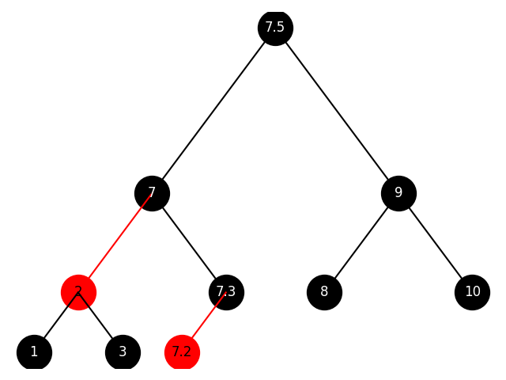

# RBTree
&emsp;&emsp;红黑树的添加操作较为简单，网上有许多详细代码与解释，本文不再赘述。本文将详细介绍红黑树的删除操作。
## 定义
  

### 概念
* ``3-节点``：由一个红节点连接一个黑节点组成。例：`(2-7)`，`(7.2-7.3)`。为便于描述，将位于``3-节点``中的节点直接称为``3-节点``。例：`节点2`是``3-节点``。对于不是叶节点的``3-节点``，有左、中、右三个子节点。例：`节点1`，`节点3`，`节点(7.2-7.3)` 分别为`节点(2-7)`的左子节点、中子节点、右子节点。
* ``2-节点``：由一个左子节点不为红节点的黑节点组成。例：`节点1`，`节点9`
* 叶节点：没有子节点的节点或有且仅有红色左子节点的节点。例：`节点1`，`节点3`，`节点7.2`，`节点7.3`。
* 继承节点：待删除节点右侧的最小节点。例：`节点9`的继承节点为`节点10`，`节点7.5`的继承节点为`节点8`。
* 相邻节点：左节点的父节点的右节点，或右节点的父节点的左节点。例：`节点1`与`节点3`，`节点3`与`节点7.3`。这里的父节点可以是``3-节点``。

### 操作
* 交换：`__swap`。交换两个节点的位置，不改变其它节点的位置。
* 嫁接：`__graft`。将节点嫁接到目标节点的左侧或右侧，目标节点原先对应的子节点信息将丢失。
* 合并子节点：`merge_children`。将目标节点的左子节点与右子节点合并为``3-节点``嫁接到目标节点左侧，将目标节点右子节点变为`None`。该操作为`Case C`中的独有操作，因此不会出现目标节点的左子节点与右子节点均为``3-节点``的情况。

## 寻找继承节点
&emsp;&emsp;为便于描述，将待删除节点记为`root`。若`root`为叶节点，则直接进入下一步。否则，寻找继承节点，并与之交换。

## 删除
&emsp;&emsp;此时`root`已为叶节点。  
&emsp;&emsp;若`root`为``3-节点``，则删除操作较简单。

* 若`root`是``3-节点``中的较小节点，直接删除。例：删除`节点7.2`，删除`节点7`。
* 若`root`是``3-节点``中的较大节点，与``3-节点``中的较小节点交换后删除。例：删除`节点7.3`。

&emsp;&emsp;若root位于`2-节点`，则分以下三种情况：

* root的相邻节点为`3-节点`，记为`Case A`。例：删除`节点3`。
* root的相邻节点为`2-节点`，父节点为`3-节点`，记为`Case B`。例：删除`节点1`。
* root的相邻节点为`2-节点`，父节点也为`2-节点`，记为`Case C`。例：删除`节点8`。

&emsp;&emsp;每种情况下还有许多小情况，如：`root`是其父节点的左子节点还是右子节点；`root`相邻的`3-节点`在其左侧还是右侧。随着这些情况的不同，会对删除操作产生一定影响，但原理都一样，因此下文中，对于这些小情况不在细分讲解。可以直接阅读代码进行理解。

### Case A
&emsp;&emsp;对于此类情况，核心思想为：
```
将合适的节点node填补到原root的位置。将相邻的3-节点变为2-节点，合理移动多出的节点填补node的空缺。
```
&emsp;&emsp;以删除`节点3`为例。节点3的相邻节点`节点(7.2-7.3)`为`3-节点`。

* 将`节点3`与`节点7`交换(左上)。
* 将`节点3`与`节点7.3`交换(右上)。
* 将`节点7.2`嫁接到`节点7.3`右侧并改变其颜色(左下)。

    


### Case B
&emsp;&emsp;对于此类情况，核心思想为：
```
将父节点中合适的节点填补到原root的位置，将父节点变为2-节点。再根据具体情况进行调整。
```
&emsp;&emsp;以删除`节点1`为例。`节点1`的相邻`节点3`为`2-节点`，父节点`(2-7)`为`3-节点`。

* 将`节点3`嫁接到`节点7`左侧(左上)。
* 将`节点2`嫁接到`节点3`左侧(右上)。
* 删除`节点1`(左下)。

    

### Case C
&emsp;&emsp;该情况是最复杂的情况。对于此类情况，核心思想为：
```
上移root，直至root满足Case A或Case B或root是整棵树的根节点。
```
#### Case C to Case A
&emsp;&emsp;以删除`节点8`为例。其相邻节点`节点10`，父节点`节点9`均为`2-节点`。

* 上移`节点8`。此时，`节点8`的相邻节点`节点(2-7)`为`3-节点`，满足`Case A`的条件(左上)。
* 合并`节点8`的子节点(右上)。
* 进行(部分)`Case A`的操作(左下)。
* 将`节点10`嫁接到`节点7.5`的右侧，将`节点7.3`嫁接到`节点7.5`的左侧(右下)。

 
 

#### Case C to Case B
&emsp;&emsp;先添加`节点7.1`，添加后的树如下图所示。

 

&emsp;&emsp;以删除`节点1`为例。其相邻节点`节点3`，父节点`节点2`均为`2-节点`。

* 上移`节点1`。此时，`节点1`的相邻节点`节点7.2`为`2-节点`，父节点`节点(7-7.5)`为`3-节点`，满足`Case B`的条件(左上)。
* 合并`节点1`的子节点(右上)。
* 进行(部分)`Case B`的操作(左中)。
* 将`节点7`嫁接到`节点7.2`的左侧，将`节点7.1`嫁接到`节点7`的右侧(右中)。
* 将`节点3`嫁接到`节点7`左侧(左下)。

 
 


#### Case C to Case C
&emsp;&emsp;为更好说明此情况，用如下树进行说明：


&emsp;&emsp;以删除`节点1`为例。其相邻节点`节点3`，父节点`节点2`均为`2-节点`。

* 上移`节点1`。此时，`节点1`的相邻节点`节点6`为`2-节点`，父节点`节点4`为`2-节点`，不满足`Case A`或`Case B`的条件(左上)。
* 合并`节点1`的子节点并上移`节点1`。此时，`节点1`的相邻节点`节点12`为`2-节点`，父节点`节点8`为`2-节点`，不满足`Case A`或`Case B`的条件(右上)。
* 合并`节点1`的子节点并上移`节点1`。此时，`节点1`是整棵树的根节点(左下)。
* 将`节点8`与`节点12`合并为`3-节点`，并将其作为新的根节点(右下)。

 
 

&emsp;&emsp;若过程中发现`root`满足`Case A`或`Case B`的条件，则直接转化为`Case C to Case A`或`Case C to Case B`即可。

## 总结
&emsp;&emsp;本文通过举例的方式将所有的大情况详细的讲述了一遍，实际上，如前文所说，各种大情况下，还有很多小情况，在编程过程中需要分别进行分类讨论，但原理与本文所举算例相似。欢迎大家进行指正批评。


